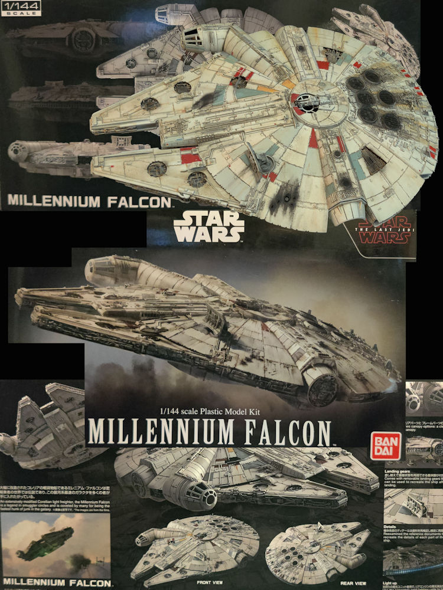
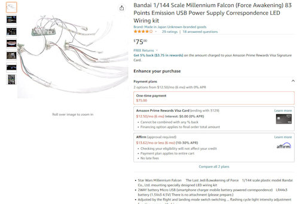
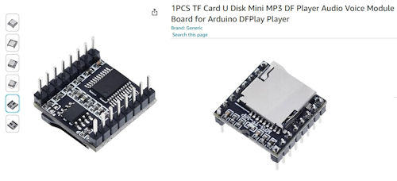
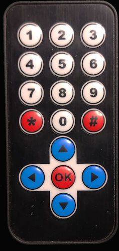

# Millennium Falcon - The Last Jedi

Here are the support files for my build of the 1/144th scale Millennium Falcon - The Last Jedi.
LED lighting, sound, and an IR Remote have been added to bring this model to life. 
 
[See My YouTube Channel for more information](https://www.youtube.com/channel/UCbk7sF8TZ_Zz9eOcTYccMCg)

## Notes

This build uses three AVR controllers. 
1) ATtiny13a - This one is part of the purchased USB lighting kit for this model. It controls the basic lighting and engines
2) ATtiny85 - Controller. This one controls additional lighting effects and can allow the IR remote to switch modes instead of using the power button
3) ATtiny85 - Sound controller. This one is responsible for all DF Player operation. It is alos tied to the same IR receiver as the other controller

## This build will use the following components in the design:

**USB Lighting Kit**

**DF Player Mini**

Sound SD Card (DF Player)
Audio Play List (mp3 folder)
mp3
0001_Starwars Theme Song short.mp3
0002_MFalcon Takeoff.mp3
0003_MFalcon Hyperdrive Fail.mp3
0004_MFalcon Hyperdrive.mp3
0005_Lazer Canon Single Shot.mp3
0006_Lazer Canon Multi Shot.mp3
0007_Explosion.mp3
0008_GetOutOfHere.mp3
0009_Starwars Theme Song long.mp3
0010_BB-8_0.mp3
0011_BB-8_1.mp3

**Uses an IR Remote to control some functions**

## Libraries

**DF Player**
A custom DF player library was used but ot was based on this Arduion library
DF Player Mini - DF Robot
https://github.com/DFRobot/DFRobotDFPlayerMini

**IR Receiver**
A TSOP362 IR Receiver (38KHz) was used and the IR Small Decoder Library was used for decoding
IR Small Decoder Lib
https://github.com/LuisMiCa/IRsmallDecoder

## Directories
- src: Contains Arduino sketch files
- lib: Associated Arduino libraries
- schematics: Images of the schematic design
- doc: Build documents 
- img: Images for this document

